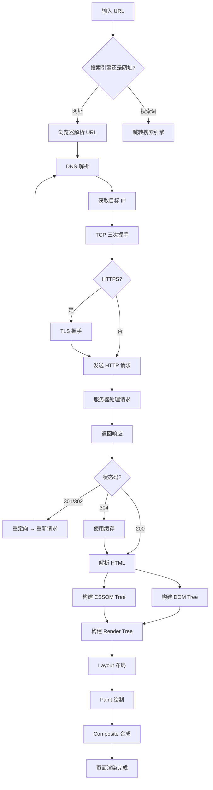

# 实操 01.2：「输入网址到页面渲染完成」全流程梳理

> ⏱ **预计时长**：60 分钟
> 📌 **难度**：⭐⭐⭐
> 🔧 **AI 辅助**：强烈建议用 AI 辅助完善知识地图中的细节

---

## 前置要求

- ✅ 已完成章节：01.1 URL/IP/DNS、01.2 HTTP 协议、01.3 缓存机制
- ✅ 已完成实操：01.1 浏览器抓包分析（熟悉 Network 面板）
- ✅ 需要安装：无（使用浏览器 + 绘图/笔记工具即可）

## 实践目标

完成本次实操后，你将能够：

1. 完整口述「从输入 URL 到页面渲染完成」的全链路流程
2. 区分每一阶段涉及的网络、操作系统、浏览器、服务器组件
3. 在遇到页面加载问题时，能定位问题出在哪个环节
4. 输出一份自己的知识地图（可用思维导图、流程图或文字描述）

---

## 背景

> "输入一个 URL 到页面渲染完成，中间发生了什么？"
> 
> 这是 Web 开发面试中的**终极问题**，它考察对整套 Web 体系的理解深度。优秀的回答能层层递进，从键盘输入到网络请求，再到浏览器渲染。

---

## http和hppts区别

- **HTTP**：明文传输协议，数据裸奔发送，无加密
- **HTTPS** = HTTP + SSL/TLS 加密隧道，所有数据先加密再传输，安全加密版本

## 步骤

### Step 1：梳理全流程的六大阶段

首先，理解完整的流程可以被划分为以下六大阶段：

```
┌─────────────────────────────────────────────────────────┐
│  ① 用户输入 & URL 解析                                  │
│     - 用户在地址栏输入文本                                │
│     - 浏览器判断是搜索关键词还是 URL                      │
│     - 补全协议（添加 http://）                            │
│     - HSTS 检查（强制 HTTPS）                            │
├─────────────────────────────────────────────────────────┤
│  ② DNS 域名解析                                         │
│     - 浏览器 DNS 缓存                                    │
│     - 操作系统 DNS 缓存 + hosts 文件                     │
│     - 本地 DNS 解析器（递归）                             │
│     - DNS 根/顶级/权威服务器（迭代）                      │
├─────────────────────────────────────────────────────────┤
│  ③ TCP 连接建立                                        │
│     - 三次握手                                           │
│     - TLS 握手（HTTPS）                                  │
├─────────────────────────────────────────────────────────┤
│  ④ HTTP 请求与响应                                      │
│     - 发送 HTTP 请求报文                                 │
│     - 服务器处理请求并返回响应                            │
│     - 状态码判断 / 重定向处理 / 缓存检查                  │
├─────────────────────────────────────────────────────────┤
│  ⑤ 浏览器解析与渲染                                     │
│     - HTML 解析 → DOM Tree                              │
│     - CSS 解析 → CSSOM Tree                             │
│     - DOM + CSSOM → Render Tree                         │
│     - Layout（布局）→ Paint（绘制）→ Composite（合成）   │
├─────────────────────────────────────────────────────────┤
│  ⑥ 资源加载 & 页面完成                                  │
│     - 解析过程中发现外部资源（CSS/JS/图片）→ 继续请求     │
│     - JavaScript 加载和执行可能阻塞解析                   │
│     - 所有资源加载完成 → onload 事件触发                  │
└─────────────────────────────────────────────────────────┘
```

### Step 2：逐阶段深挖 — 制作你的知识卡片

对于每个阶段，填写下表。建议用你学到的知识先自己写，再用 AI 补充和验证。

#### 阶段 ①：用户输入 & URL 解析

| 问题                                            | 你的答案                  |
| --------------------------------------------- | --------------------- |
| 用户在地址栏输入了文字，浏览器怎么知道是搜索还是网址？                   | 协议标识，域名后缀，特殊符号=>网址 \| |
| 浏览器 URL 补全规则是什么？（为什么有时加 http://，有时加 https://） |                       |
| HSTS 是什么？浏览器怎么知道一个网站必须用 HTTPS？                |                       |
| URL 的各部分（协议/域名/路径/参数）是如何被解析的？                 |                       |

#### HSTS 是什么

全称**HTTP Strict Transport Security**，是服务端下发的响应头，作用是强制浏览器后续访问该域名必须使用 HTTPS 加密连接，禁止明文 HTTP。

#### 阶段 ②：DNS 域名解析

| 问题                            | 你的答案                                                          |
| ----------------------------- | ------------------------------------------------------------- |
| 浏览器从哪里开始查 IP？先后顺序是什么？         | 浏览器 DNS 内存缓存、操作系统 hosts 文件、操作系统本地 DNS 缓存、向运营商 DNS 服务器发起网络递归解析 |
| hosts 文件在哪里？其优先级和 DNS 缓存比哪个高？ |                                                               |
| 什么是 DNS 递归查询？什么是迭代查询？         |                                                               |
| DNS 解析一般需要多少时间？如何优化？          |                                                               |

**递归**：我只问一次，你帮我查完把结果给我；

        客户端（浏览器 / 本地 DNS 服务器）只发**一次请求**给本地 DNS 服务器；

**迭代**：我问你，你只告诉我下一个找谁，我自己接着去问。

        本地 DNS 服务器向根服务器发起请求，根服务器不会返回最终 IP，只会告诉它「去问顶级域名服务器」；
    
        本地 DNS 再向下一级服务器发起新请求，反复多次，直到拿到目标 IP；

#### 阶段 ③：TCP 连接建立

| 问题                            | 你的答案 |
| ----------------------------- | ---- |
| 三次握手具体是怎么交互的？用通俗语言描述。         |      |
| 为什么是三次握手，而不是两次或四次？            |      |
| HTTPS 在 TCP 之上多了什么步骤？（TLS 握手） |      |
| TLS 握手时，客户端和服务器交换了什么信息？       |      |

#### 阶段 ④：HTTP 请求与响应

| 问题                                      | 你的答案 |
| --------------------------------------- | ---- |
| 浏览器构建的 HTTP 请求报文包含哪些部分？                 |      |
| 服务器返回的响应中，状态码 200/301/304/404 分别对应什么流程？ |      |
| 如果服务器返回 301，浏览器下一步做什么？                  |      |
| 缓存命中（200 from cache / 304）的流程有什么区别？     |      |

#### 阶段 ⑤：浏览器解析与渲染

| 问题                              | 你的答案 |
| ------------------------------- | ---- |
| DOM Tree 和 CSSOM Tree 分别是怎么构建的？ |      |
| Render Tree 和 DOM Tree 有什么区别？   |      |
| Layout（回流）和 Paint（重绘）的区别是什么？    |      |
| JavaScript 的加载和执行对页面渲染有什么影响？    |      |

##### DOM Tree（文档树）

浏览器从上到下逐行解析 HTML 文本：

1. 读到 HTML 开始标签就创建对应节点，读到结束标签闭合节点；

2. 根据标签嵌套关系生成父子层级；

3. 全部解析完成后生成完整 DOM 树，存储页面所有 HTML 标签结构。
   
   限制：遇到无`defer/async`的`<script>`会暂停 HTML 解析，优先下载、执行 JS。

##### CSSOM Tree（样式树）

浏览器解析页面所有样式（外部 CSS、`<style>`、行内 style）：

1. 先加载浏览器默认内置样式，再解析开发者写的 CSS 规则；

2. 把每条样式规则和 DOM 节点做匹配，生成带样式信息的层级树；

3. 合并所有样式权重，得到每个 DOM 节点最终生效样式。

4. 限制：CSS 会阻塞页面渲染，但不会阻塞 HTML 解析 

##### Render Tree 和 DOM Tree 有什么区别？

1. **DOM Tree**：包含页面**全部 HTML 节点**，注释、script、`display:none`隐藏元素都存在，只记录标签结构，不带样式。
2. **Render Tree（渲染树）**：只保留**页面可见元素**，直接剔除`display:none`、注释等不需要绘制的节点；每个节点同时绑定 DOM 结构 + CSSOM 样式，专门用于页面布局、绘制。

简单总结：DOM 存完整标签结构，Render Tree 只存需要画到屏幕、带样式的元素。

#### 阶段 ⑥：资源加载 & 页面完成

| 问题                                           | 你的答案                                                                                          |
| -------------------------------------------- | --------------------------------------------------------------------------------------------- |
| 为什么 CSS 通常放在 `<head>` 中，而 JS 放在 `</body>` 前？ |                                                                                               |
| `<script>` 的 `async` 和 `defer` 属性有什么区别？      |                                                                                               |
| `DOMContentLoaded` 和 `load` 事件的区别是什么？        | load<br/>触发时机：页面所有资源全部加载完毕DOMContentLoaded<br>触发时机：HTML 解析完成、DOM 树构建完毕，无需等待图片、CSS、视频等外部资源加载完成 |
| 页面总加载时间 = 哪个时间点减去哪个时间点？                      | load 事件触发时间点 − 浏览器发起页面请求的开始时间点                                                                |

简单记：**从请求页面开始，到所有资源全部加载完成的总时长**。

**defer和async：**

- defer：等页面写完，按顺序执行**（稳、有序）
- async：下载完就插队，顺序乱（快、无序）

### Step 3：可视化输出 — 画一张完整流程图

**操作说明：**

1. 用你喜欢的工具（手绘拍照、draw.io、Excalidraw、Mermaid 等）画一张**从输入 URL 到页面渲染完成**的完整流程图
2. 每阶段用不同颜色标注
3. 标注出**面试常考点**和**可能的性能瓶颈**

**Mermaid 示例（你可以直接在支持 Mermaid 的 Markdown 编辑器中渲染）：**



#### 阶段 1：输入 URL，区分搜索词 / 网址

1. 用户在浏览器地址栏输入文字；

2. 浏览器自动判断输入内容是**网址**还是**搜索关键词**：
   
   - 若为纯中文、无域名后缀等搜索词：直接跳转默认搜索引擎，结束本次网址加载流程；
   - 若识别为合法网址：进入 URL 解析流程。

#### 阶段 2：URL 解析 + DNS 域名解析（查询 IP）

1. 浏览器拆分 URL，提取协议、域名、路径、请求参数；

2. 按固定顺序查询域名对应的 IP 地址：
   
   浏览器 DNS 缓存 → hosts 文件 → 操作系统 DNS 缓存 → 运营商 DNS 服务器；

3. 完成解析，拿到服务器目标 IP。

#### 阶段 3：TCP 连接建立（三次握手）

浏览器客户端与目标服务器 IP 通过 TCP 三次握手，建立可靠数据传输通道：

1. 客户端发送 SYN 同步包，告知服务器想要建立连接；
2. 服务器回复 SYN+ACK 包，确认收到请求、同时同步自身连接标识；
3. 客户端发送 ACK 确认包，双向通信通道正式建立。

#### 阶段 4：判断协议，HTTPS 执行 TLS 握手

1. 判断 URL 协议是否为 HTTPS：
   
   - 若是 HTTPS：在 TCP 通道之上执行 TLS 握手，协商加密算法、交换证书、生成会话密钥，建立加密传输隧道；
   - 若是 HTTP：无加密步骤，直接明文传输数据；

2. 加密 / 明文通道就绪后，浏览器发送标准 HTTP 请求报文。

#### 阶段 5：服务器处理请求并返回响应

1. 后端服务器接收 HTTP 请求，路由匹配接口 / 页面资源；
2. 执行业务逻辑，拼接页面 HTML 文件，同时携带缓存标识、重定向地址等响应头；
3. 服务器向浏览器返回 HTTP 响应报文。

#### 阶段 6：根据响应状态码分支处理

1. **状态码 301/302（重定向）**：响应头携带新 URL，浏览器跳转至新地址，从头重复 DNS、TCP、请求全流程；
2. **状态码 304（协商缓存命中）**：服务器告知资源无更新，浏览器直接读取本地缓存 HTML，跳过资源下载；
3. **状态码 200（请求成功）**：服务器下发完整 HTML 页面源码，进入页面解析渲染阶段。

#### 阶段 7：浏览器解析 HTML，生成两棵核心树

浏览器并行执行两项解析工作：

1. 解析 HTML 文本，生成**DOM Tree（文档树）**：存储页面全部标签结构；
2. 解析页面所有 CSS（外部样式、行内样式），生成**CSSOM Tree（CSS 样式树）**：存储所有元素样式规则；

> 注意：普通`<script>`会阻塞 HTML 解析，async/defer 异步脚本不阻塞解析。

#### 阶段 8：生成渲染树 Render Tree

合并 DOM Tree 与 CSSOM Tree，生成 Render Tree：

1. 仅保留页面**可见元素**，剔除`display:none`、注释、脚本等无需绘制的节点；
2. 每个节点同时绑定 DOM 结构与对应 CSS 样式，专供页面绘制使用。

#### 阶段 9：页面渲染三步流水线

1. **Layout 回流（重排）**：遍历渲染树，计算每个元素的宽高、坐标、页面占位布局；元素尺寸 / 位置变化会重复触发回流；
2. **Paint 重绘**：按照布局计算结果，给每个像素填充颜色、背景、文字等视觉样式；仅颜色变化只会触发重绘，无回流；
3. **Composite 分层合成**：将页面分层绘制，transform/opacity 修改仅触发合成，性能最优。

#### 阶段 10：页面加载完成

分层合成结束，页面完整展示在屏幕上：

1. HTML 解析完成触发`DOMContentLoaded`事件；
2. 图片、字体、视频等所有外部资源全部加载完毕后，触发`load`事件，页面总加载时长计算完成。


 

### Step 4：用 AI 验证和深化理解

**AI 辅助用法：**

> **提示词示例 1 — 验证性提问：**
> 
> ```
> 我总结了从输入 URL 到页面渲染的流程，请帮我检查是否有遗漏或错误：
> [粘贴你的流程图描述或文字总结]
> ```

> **提示词示例 2 — 深入追问：**
> 
> ```
> 在 DNS 解析阶段，如果本地 DNS 缓存、hosts 文件、DNS 服务器都没有记录，
> 完整的递归查询流程是怎样的？请用流程图说明。
> ```

> **提示词示例 3 — 故障排查：**
> 
> ```
> 用户在浏览器输入 URL 后等了 10 秒才看到页面，
> 请从全流程角度分析可能出问题的环节以及怎么排查。
> ```

---

## 验证标准

完成实践后，逐项检查：

- [x] 不看文档，能口述六大阶段的完整流程
- [x] 能解释三次握手和四次挥手的作用
- [x] 能区分强制缓存和协商缓存在流程中的不同表现
- [x] 能说出 `DOMContentLoaded` 和 `load` 事件的区别
- [x] 完成了至少一张流程图（手绘/电子版均可）
- [x] 用 AI 验证了至少 3 个你不太确定的环节

---

## 思考题

1. 如果一个资源请求耗时很长，你觉得最可能是哪个环节的问题？怎么验证你的猜测？
2. 为什么现代网站建议把 CSS 放在头部、JS 放在尾部？（结合渲染流程分析）
3. 如果 `https://example.com` 强制跳转到 `https://www.example.com`，状态码是 301，这中间的完整流程是怎样的？
4. 用 AI 生成一个场景：用户在弱网环境下访问一个大型网站，请描述每一阶段的耗时变化。

---

## 拓展阅读 & 参考回答

面试中这个问题的**高质量回答**应该展现层次感：

> **青铜回答**：DNS 查 IP → 发请求 → 拿响应 → 渲染页面
> **白银回答**：URL 解析 → DNS 递归查询 → TCP 三次握手 → HTTP 请求 → 服务器处理 → 浏览器解析 HTML 构建 DOM → 加载子资源 → 渲染
> **黄金回答**：在上述基础上加入：HSTS 检查、TLS 握手、缓存策略判断、关键渲染路径（DOM/CSSOM/Render Tree/Layout/Paint/Composite）、JS 阻塞解析与 async/defer 优化、Preload/Prefetch 等现代优化

---

*上一节实操：[实操 01.1 浏览器抓包分析](practice-01.1-browser-devtools-capture.md) | 下一章：[02-AI Agent入门](../../02-introduction-to-ai-agent/theory/)*

#### 

#### 2. 浏览器 URL 补全规则（http/https 区分）

##### 基础补全逻辑

1. 用户只输入域名（如`baidu.com`），浏览器自动补全协议；

2. 优先尝试`https://`（现代浏览器默认 HTTPS 优先），发送 HTTPS 连接请求：
   
   - 服务器支持 HTTPS：最终使用`https://`；
   - HTTPS 连接失败、无 HSTS 记录：自动降级为`http://`；

3. 用户手动输入`http://xxx.com`：强制使用明文 HTTP 协议，不自动升级；

4. 历史访问过的站点存在 HSTS 记录：永久强制补全`https://`，不再尝试 HTTP。

##### 为什么有时 http、有时 https

- 站点支持 HTTPS、无连接失败：补全`https://`；
- 站点仅支持 HTTP、HTTPS 访问报错：补全`http://`；
- 存在 HSTS 缓存记录：强制使用 HTTPS，永不走 HTTP。

#### 3. HSTS 定义 + 浏览器强制 HTTPS 原理

##### HSTS 是什么

全称**HTTP Strict Transport Security**，是服务端下发的响应头，作用是强制浏览器后续访问该域名必须使用 HTTPS 加密连接，禁止明文 HTTP。

##### 浏览器强制 HTTPS 的流程

1. 用户第一次 HTTPS 访问网站，服务器返回响应头 `Strict-Transport-Security: max-age=31536000; includeSubDomains`；

2. 浏览器将该域名存入本地 HSTS 缓存，有效期由`max-age`（秒）控制；

3. 缓存生效期间，用户再输入`http://域名`、或仅输入域名时：
   
   浏览器**本地直接拦截 HTTP 请求**，自动替换为`https://`，不发起 HTTP 网络请求；

4. `includeSubDomains` 代表该域名所有子域名（如`www.xxx.com`、`api.xxx.com`）全部强制 HTTPS。

#### 4. URL 四部分解析顺序（协议 / 域名 / 路径 / 参数）

标准完整 URL 格式：`https://www.baidu.com/s?wd=test`

##### 1）协议（Protocol）

`https://`，位于最前端，定义传输加密方式（http/https/ftp），`://`是协议结束标记；

##### 2）域名（Host / 域名）

`www.baidu.com`，协议后到第一个`/`为止，用来通过 DNS 解析获取服务器 IP；

##### 3）资源路径（Path）

`/s`，域名后、问号`?`之前的内容，代表服务器上具体页面 / 接口文件位置；

##### 4）查询参数（Query 参数）

`?wd=test`，以`?`开头，多个参数用`&`分隔，是 GET 请求携带的 URL 参数，传给后端接口；

##### 整体解析流程

1. 先截取`://`前字符串识别传输协议；
2. 截取协议后、第一个`/`之间的字符串作为域名，执行 DNS 解析；
3. 域名后的`/`到`?`之间为资源路径，定位服务器资源；
4. `?`之后全部拆分键值对，作为 URL 查询参数传递给服务端。
